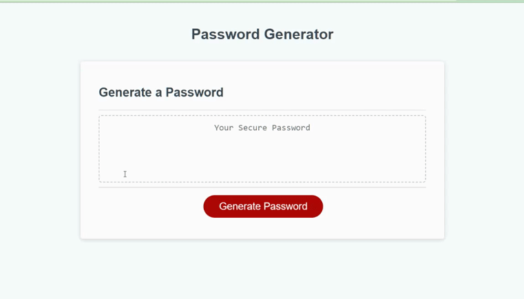

# Password Generator
## Description
This application generates a password based on the user's desired password criteria, including the length and what characters the password will contain. 

### User Story
```
AS AN employee with access to sensitive data
I WANT to randomly generate a password that meets certain criteria
SO THAT I can create a strong password that provides greater security
```

### Acceptance Criteria

```
GIVEN I need a new, secure password

WHEN I click the button to generate a password
THEN I am presented with a series of prompts for password criteria

WHEN prompted for password criteria
THEN I select which criteria to include in the password

WHEN prompted for the length of the password
THEN I choose a length of at least 8 characters and no more than 128 characters

WHEN asked for character types to include in the password
THEN I confirm whether or not to include lowercase, uppercase, numeric, and/or special characters

WHEN I answer each prompt
THEN my input should be validated and at least one character type should be selected

WHEN all prompts are answered
THEN a password is generated that matches the selected criteria

WHEN the password is generated
THEN the password is either displayed in an alert or written to the page
```

## Screenshots
  
  

## Credits
Bobbi Tarkany - helped with figuring out how to put all user's choices into a container and generate a password with them

## License 
MIT

## Deployed Website Link
